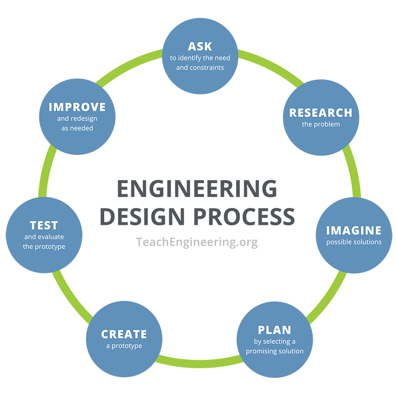

# Finch Robot: Ball Toss

### Development Checklist

| Completed | Task         | Description |
|:---------:| :-----------:|:------------|
|    ✅     | Familiarize  | Learn how to: <ul><li>Connect to the robot</li><li>Interpret what built-in sensors detect</li><li>Program basics in SNAP!</li><li>Setup local developing environment to code in Java</li></ul>|
|    ✅     | 3D Design    |             |
|    ✅     | Develop Code |             |

---

<details>
<summary><strong>Inspiration for the Project</strong></summary>

Initially we wanted to go for something unique which led us to initially choosing a custom built maze which would be solved by moving a partially stable object so as the robot moves the ball would move within the maze. Although it was too unrealistic and we scrapped the idea. Later to do something unique we decided to do a corn hole toss but with balls.
</details>

---

### Design Cycle


The design cycle above was something we indirectly used to guide us through this project. First we got all of the parameters for the finch hole and how well it would stabilize. Once we found that part out we realized that in our prototype the stick was too thin which led us to increasing the width of it. Once we figured out the issues we decided to make a new model which was a wider version that had barriers on the side to catch the ball if missed. After our redesign we printed it out and checked the size which was a perfect fit and the model was the perfect size.
---

### Code to Highlight
```

public class FinchButtonScore {
    public static void main(String[] args) {
        Finch finch = new Finch(); // Initiates finch robot
        int score = 0; // creates score variable

        while (true) { keeps program running forever
            if (finch.getButton("A") || finch.getButton("B")) { // checks if either button is pressed
                score++;  // adds to score=

                while (finch.getButton("A") || finch.getButton("B")) {} // the program wont do anything if it is held
            }
        }
    }
}

```

---

### Choose At Least Three of the Following to Include:
Our motivation towards this project was we wanted a fun but unique game that anyone could play which led us to brainstorm several ideas all eventually ending at this sack toss type of game. We believed it was a great way to have fun while trying out how the robot functions.
During this project we've learned several coding vocabulary words while coding the actions for this finch robot. We learned things such as finch robot movement, a score system based off of the button presses, and a way to communicate the score and time numbers.
Our project stands out because..
